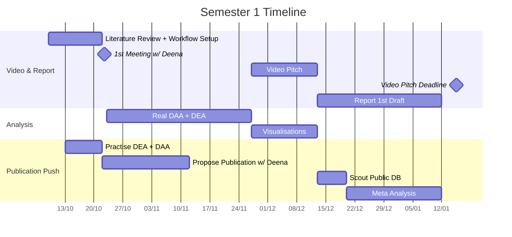
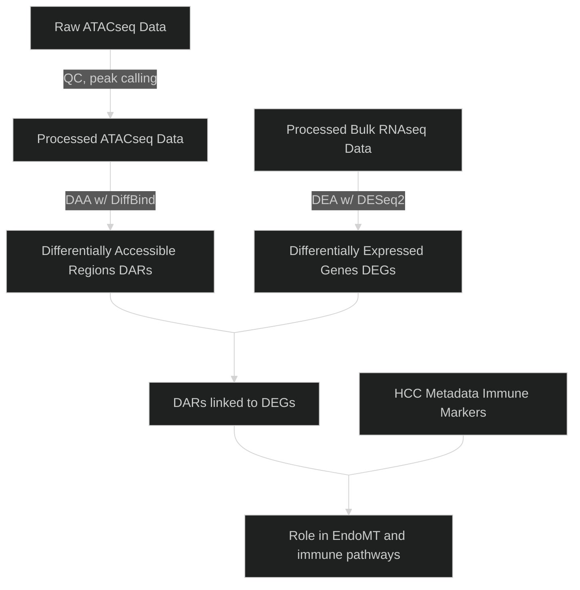

# 🧬 Epigenetic regulation of liver endothelial cells (LSECs) as a novel target to boost immunotherapy efficacy in hepatocellular cancer (HCC)

This project focuses on **EHMT2**, an epigenetic regulator, and its links with immune pathways and the *endothelial-to-mesenchymal transition* in *liver sinusoidal epithelial cells* (LSECs) which aid in the development of *hepatocellular cancer* (HCC).

## 📋 Plan Overview


## 🎯 Objectives



1) Analyse RNA-seq data from LSECs samples with and without EHMT2 knockdown to identify differentially expressed genes (DEGs).

2) Analyse ATAC-seq data from LSECs samples with and without EHMT2 knockdown to identify differentially accessible regions (DERs).

3) Compare DEGs against DERs to validate downstream effects of EHMT2 knockdown.

4) Study DEGs and DERs to find associations with immune markers.

## 📁 Files & Directories

```bash
bioinformatics-project/
├── docs/                    # essential and useful project docs
│   ├── tasks.docx
│   ├── minutes.docx
│   ├── report.pdf
│   ├── presentation.mov 
│   └── references.bib
├── notebooks/                # markdown notes
├── data/
│   └── raw/                  # symbolic links to Blue BEAR. do not track
├── rnaseq-scripts/           # for Yash
│   └── preprocessing/ 
├── atacseq-scripts/          # for Leo
│   └── preprocessing/ 
├── results/                  # publication-ready plots, tables, etc.
├── README.md
└── .gitignore                # list of files to not track
```


## 👥 Contributors

- Zhaoshuo Liu

- Yash Dhiman

- Simran Panda

- Miguel Alburo
