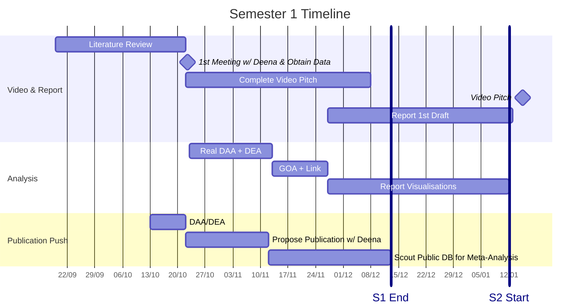
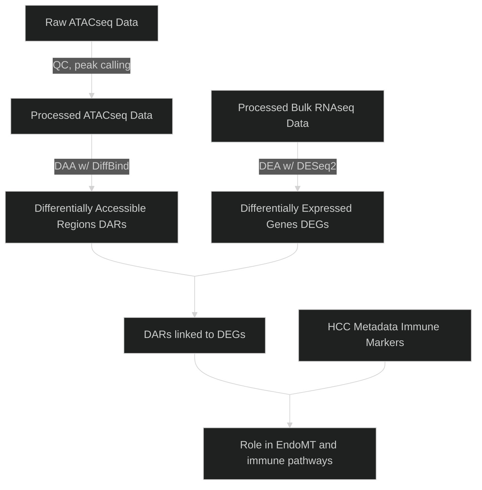

# 🧬 Epigenetic regulation of liver endothelial cells (LSECs) as a novel target to boost immunotherapy efficacy in hepatocellular cancer (HCC)

This project focuses on whether *EHMT2*, an epigenetic regulator, directly influences immune pathways and the endothelial-to-mesenchymal transition (*EndoMT*) in liver sinusoidal epithelial cells (LSECs) which aid in the development of *hepatocellular cancer* (HCC).

## Current Progress


## 🎯 Objectives



1) Analyse ATAC-seq data from LSECs with and without EHMT2 knockdown to identify alterations in chromatin accessibility regions influenced by EHMT2-mediated methylation.

2) Correlate ATAC-seq findings with bulk RNA-seq data from the same samples to determine how EHMT2’s downstream
effects influence gene transcription, particularly for EndoMT markers (e.g., αSMA, vimentin) and immune cell recruitment
pathways.

3) Identify key differentially accessible regions and associated genes that may explain EHMT2’s role in promoting immune
evasion in the HCC TME, supporting further experiments with human HCC samples and in vitro models (e.g., flow-based
adhesion assays investigating EHMT2 impact on immune cell recruitment).

## 📁 Files & Directories

```bash
bioinformatics-project/
├── docs/                    # essential and useful project docs
│   ├── tasks.docx
│   ├── minutes.docx
│   ├── report.pdf
│   ├── presentation.mov 
│   └── references.bib
├── notebooks/
├── data/
│   ├── raw/                  # symbolic links or small example subsets only
│   ├── processed/
│   └── metadata/             # sample info, config, manifests
├── scripts/
│   ├── preprocessing/ 
│   ├── analysis/             # main workflows
│   ├── visualization/
│   └── utils/                # helper functions
├── results/                  # publication-ready plots, tables, etc.
├── README.md
└── .gitignore                # list of files to not track
```


## 👥 Contributors

- Zhaoshuo Liu

- Yash Dhiman

- Simran Panda

- Miguel Alburo
